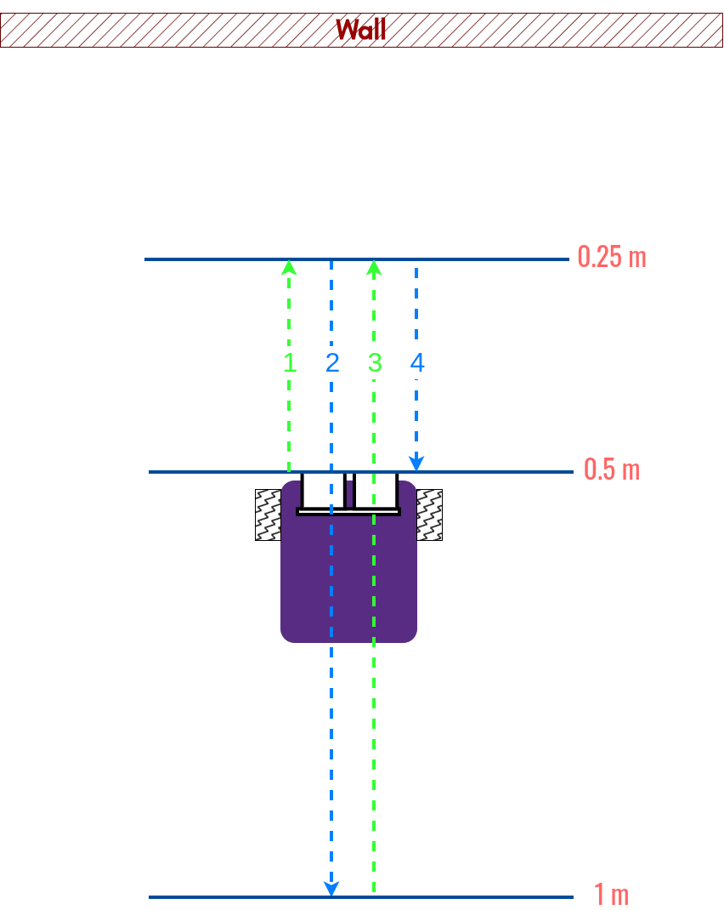

# Sense Distance
## 1. Overview
Maneuver a differential driving mobile base using a dual-channel H-Bridge motor driver board according to the wall distance perceived from a ultrasonic sensor. 

## 2. Requirements:
> [!IMPORTANT]
> Redeem points by **showcasing to Dr. Zhang** in the classroom (LEDG 100N)

### 2.1. (20%) Configure physical device
- (5%) Wire up the battery and the (optional) voltage converter.
- (5%) Wire up motor driver board to Pico.
- (3%) Wire up a **common cathode** RGB LED to Pico.
- (7%) Wire up ultrasonic distance sensor to Pico. 
> [!IMPORTANT]
> - Please use a voltage dividing circuit (shown below) to down scale `Echo` pin's output voltage to a safe range for the Pico board.
> - Please get the mobile base ready. Feel free to print parts from [TBot's mechanical designs](https://github.com/linzhangUCA/r1b_mechanical/tree/main).

### 2.2. (25%) Voltage divider analysis
Let's assume the resistors in the above diagram are swapped, so $R_1 = 1.2 k\Omega$, and  $R_2= 2 k\Omega$.
And both resistor are with 5% tolerance. 
1. (5%) Please write down the math equation for calculating the signal voltage feed into the Pico's GPIO pin.
2. (20%) Based on your calculation, can Pico correctly work with the received `Echo` signal? Why or why not? 

> [!IMPORTANT]
> Please define the new symbols in your equation(s).

### 2.3. (53%) Sense distance and drive
Place your robot (distasnce sensor) 0.5 meters away from the wall. Start [wall_sensing.py](wall_sensing.py), and perform the following movements in sequence.
1. (5%) Initialization (One-Time system check): blink all LEDs at the same time if the sensor found the wall (distance of `None` means no wall was found).
    Blink LEDs with frequency of 5 Hz, lasting 2 seconds.
2. (10%) Drive **forward** with `GREEN` on.
3. (2%) **Stop 1 second** with `RED` on, when distance to the wall is 0.25 +/- 0.1 meters.
4. (10%) Drive **backward** with `BLUE` on.
5. (2%) **Stop 2 second** with `RED` on, when distance to the wall is 1 +/- 0.1 meters.
6. (10%) Drive **forward** with `GREEN` on.
7. (2%) **Stop 1 second** with `RED` on, when distance to the wall is 0.25 +/- 0.1 meters.
8. (10%) Drive **backward** with `BLUE` on.
9. (2%) **Stop** with `RED` on, when distance to the wall is 0.5 +/- 0.1 meters.    

> [!IMPORTANT]
> - Do not start the robot if the distance sensor failed to detect the wall.
> - When one LED is on, other LEDs need to be turned off.
> - You may need to upload [distance_sensor.py](distance_sensor.py), [motor.py](motor.py) and [diff_driver.py](diff_driver.py) to the Pico board.

> [!TIP]
> - Pick a good speed for motors.
> - Polish your caster wheel or do some extra coding to make your robot move in straight lines.
> - It is OK to use the [picozero](https://picozero.readthedocs.io/en/latest/) library for the distance sensor.

### 2.4 (2%) AI Usage Policy
If AI helped with this assignment, please list out all the contributions.

